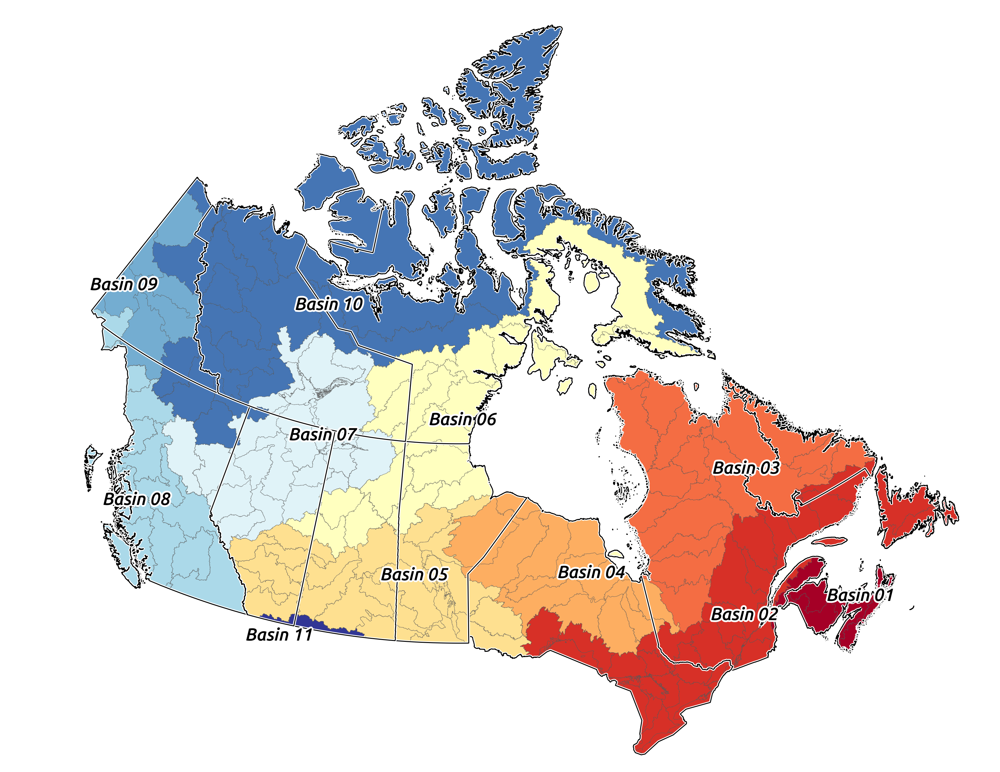
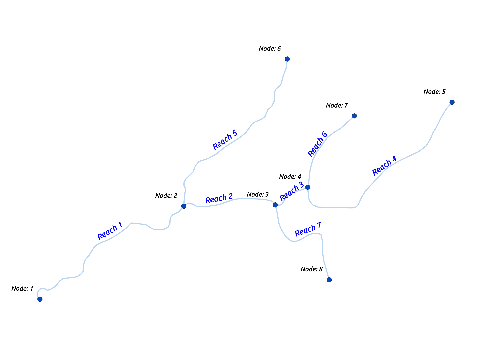
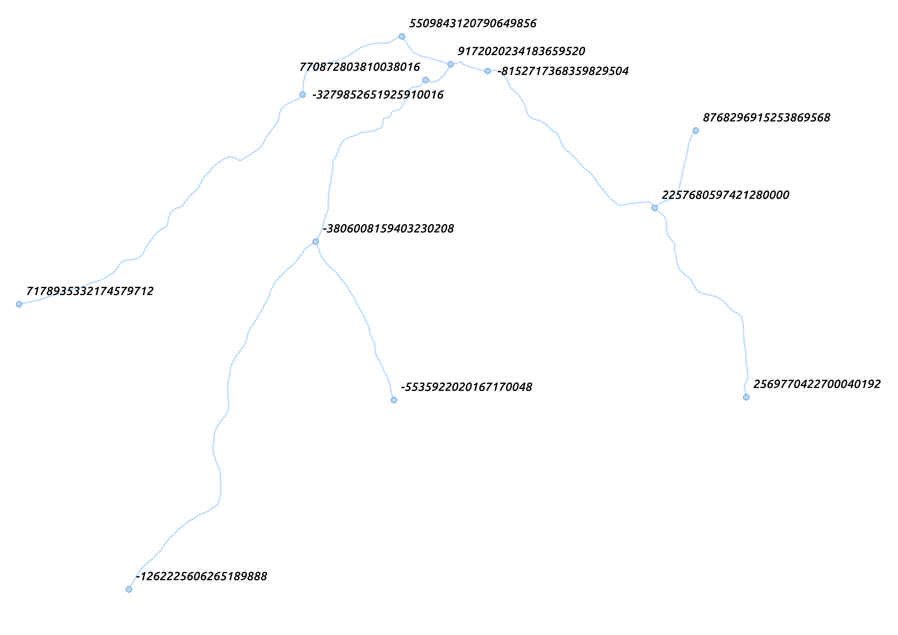
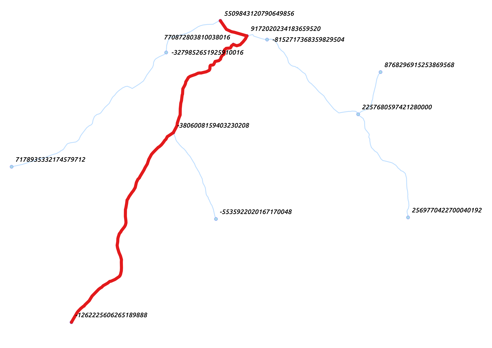

# Routing Canada’s Waterways with pgRouting - Part 1.

### Introduction

I’ve recently started at Sparkgeo as a Geospatial Developer and thought what’s a better way to introduce myself than with a series of blog posts. My background and passion is Remote Sensing but i’ve always enjoyed GIS pursuits closer to the ground.

This blog series will focus on Canada’s waterways and how we can navigate through them using database routing. To facilitate this I will be using the National Hydro Network (NHN) from Natural Resource Canada (NRCAN) , PostgreSQL(v. 10.0), the extensions PostGIS(v. 2.4) and pgRouting(v. 2.5), and QGIS(v. 2.18) and Mapnik(v.2.0) for visualizations. I’ll be doing these on an Ubuntu 16.04 machine. 

In Part 1 we will setup our database, load the NHN so it’s ready for routing, and test the routing using an example.

Let’s get started!

## Installation.

As mentioned, I will be doing all of these steps on Ubuntu, so while the logic should work, your mileage may vary on other OS’s. 
Ok, let’s start off by installing Postgres. As is usually the case, we will consult the official documentation on the best way to install postgres for our OS. I’ll paraphrase it below, but your best bet is to check the link.

Now we will install Postgres 10.0 and its helper package, PostGIS, and pgRouting. We will add our username to the postgres roles and setup the database we will be using. In order to do that we need to switch to the postgres user so that we can get into the database to begin with.

Let’s go back to our account and log in to our database. Since we created an account with our OS username, all we have to specify is the database we want to connect to. If you created a postgres account that is different than your OS username, use the -U flag to specify the postgres account you want to connect with.

Ok now we should be in the database, let’s create the PostGIS and pgRouting extensions.

Great, you should now have an empty database that is setup for spatial queries and routing. Let’s change that empty part.

## Hydro Data.

The database being set up is all well and good, but pretty useless without some data in it.
We are going to use NRCAN’s FTP site to grab our data and I’m going to use FileZilla to pull all of the data down. How to setup and use FileZilla is beyond the scope of this tutorial so if you are unfamiliar with FTP access, go ahead and download the software and readup. I’ll wait.

For those of us familiar with FTP access, point to this url: 
ftp://ftp.maps.canada.ca/pub/nrcan_rncan/vector/geobase_nhn_rhn/shp_en/
and grab the Hydro Regions you are looking for. Hydro regions are separated by drainage areas (and sub-drainage areas and sub-sub-drainage areas, etc.). Seeing as this is a tutorial and the country is quite large, I’m only going to grab drainage area 8 (Feel free to grab the area you are interested in, but keep in mind that some identifiers that i’m going to use will be different).

Major Drainage Areas of Canada.

So now that we’ve download the data we want, lets load it up into our fresh PostGIS, pgRouting enabled database. For this part, we will be using a tool called shp2pgsql. (You can use ogr2ogr if you want as well, however shp2pgsql comes bundled with PostGIS so there is nothing new to install.) 

The NHN data comes unprojected in NAD83(CSRS98) - EPSG:4140 so we will convert it to a projected coordinate system when we load it up. Since we are working with Drainage Area 8, which covers most of BC. I will be using UTM10N - EPSG:26910.
The script below iterates through the shapefiles in the directory, sets appropriate flags for shp2pgsql, creates sql for each shapefile and then loads them all into your postgres database as nodes and edges tables. 

Create an empty file called `load_hydro.sh` in the directory that you downloaded the NHN data to and copy the below script into the `load_hydro.sh` file. (You can run it by typing bash `load_hydro.sh` from the command line)

Once those are all loaded up (and it will take a while), you should have two tables in your database; nhn_08_nodes and nhn_08_edges. The nodes table are the intersections where streams and rivers meet and the edges table holds the linestrings of the streams and rivers. 

The people who created and maintain the NHN have done, and continue to do, an outstanding job of curating this dataset. The NHN is topologically correct and has defined from/to points so we can go ahead and use this for routing without the need to create our own routable network!
However, we do need to clean up the tables so that they work with pgRouting. Let’s start by making sure that we are only dealing with networked datasets, that is we don’t want any isolated lines and points. Fortunately, the edges table has a column named isolated, so this is already done for us. A couple queries to remove the isolated bits from the nodes and edges and we are on our way.

Ahhh, freshly cleaned data, nothing like it.

## Routing.

For pgRouting to work we need to be able to identify where something is coming from and where it is going to, a source and a target. Since the NHN splits rivers into segments whenever another river meets with the original, we will have multiple sources and targets for a river.

Example of a routable network.

In the example above the headwaters are on the right and the outlet is on the left. Reach 2-5 all contribute to the main stem, Reach 1, but each reach has separate start and end points (sources and targets). Reach 5, for example, has a source of Node 6 and a target of Node 2. In routing for Reach 5 to Reach 1, we would need to determine the source and targets for all points along the total length (Reach 5 and Reach 1). These would be Node 6 -> Node 2 and Node 2 -> Node 1.

Thankfully pgRouting does this for us after we define the columns we want to use for sources and targets. However, These columns must be in the type integer and the columns defined in NHN as source and target are in type varchar.

The source and target columns in the NHN are called from_junt and to_junct respectively. The id’s used in these columns are a UUID and are called National Identifiers (NID) and are unique across Canada. Since these are unique, we will need some way of converting the varchar NID into a integer while preserving the uniqueness. A quick journey to [stackoverflow]('https://stackoverflow.com/questions/12375369/convert-hex-string-to-bigint-in-postgres') gives us the answer for how to convert hex to int. We can use this in our query when generating the source and target columns from the from_junt and to_junct columns and while we are at it we should update the NID columns to int so that all our values will match between the nodes and edges tables. 
*Note: pgRouting needs any integer type, so i’m using bigint since the ID’s can get fairly large

And with that we should be good to go for routing.

Since we are dealing with water, and there is really only one way which water can flow*, we have a fairly basic network setup. So routing will be fairly boring at this point. Nevertheless, let’s do an example to confirm that it is working properly. 

* Water flowing up in the Faroe Islands due to wind. pgRouting does not take this into account. :(

In order to get start and endpoints, I loaded the nhn_08_edges and nhn_08_nodes into QGIS to see which node ID’s would be good candidates for routing.

Example nodes for routing.

Using the ID’s above, run the following sql statement to confirm routing. We will be using dijkstra’s for testing but feel free to experiment with other routing algorithms. I’ve simply used the length of each segment as the cost parameter.

If you want to visualize the result in QGIS, join the output onto the edges table to grab the geometry.

The output should look like this. The red line is the route produced by dijkstra's algorithm. Add other start and end ID’s and see what you can come up with.

Output line geometry from pgRouting.

You now have a routable hydro network for most of British Columbia. Go forth and explore!
In the next part we will work on manipulating the data more so we can make some cool visualizations!

## References:
Natural Resource Canada: 
http://ftp.maps.canada.ca/pub/nrcan_rncan/vector/geobase_nhn_rhn/doc/

Water Survey of Canada
https://catalogue.data.gov.bc.ca/dataset/water-survey-of-canada-sub-sub-drainage-areas

Shp2pgsql:
http://www.bostongis.com/pgsql2shp_shp2pgsql_quickguide.bqg

pgRouting
http://docs.pgrouting.org/latest/en/
